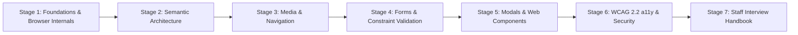
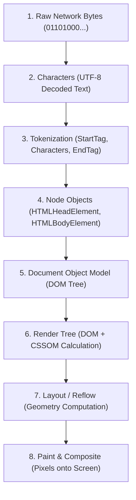
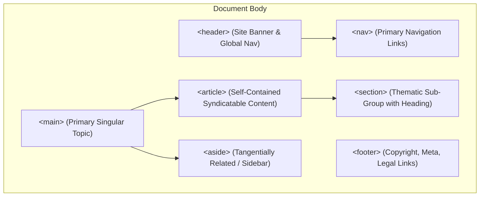
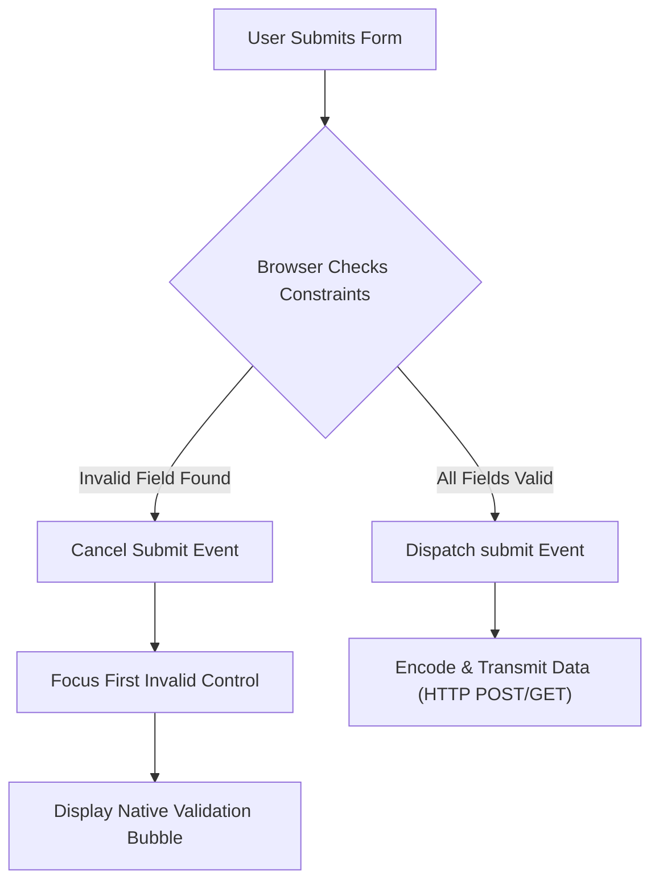
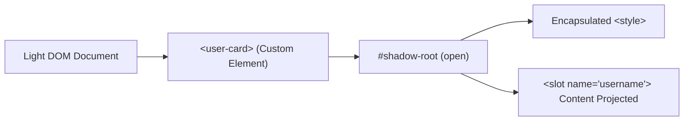

# Learn HTML5 🌐

<div align="center">

[](https://opensource.org/licenses/MIT)
[](https://html.spec.whatwg.org/)
[](https://www.w3.org/WAI/standards-guidelines/wcag/)
[](https://vitest.dev/)
[](https://github.com/manthanank/learn-html)

**An exhaustive, production-grade masterclass from absolute zero to staff-level web platform engineering.**  
Master modern semantic architecture, the browser's critical rendering path, responsive multimedia art direction, enterprise form constraint validation, native Web Components, and strict WCAG 2.2 / WAI-ARIA accessibility.

[Getting Started](#-stage-1-zero-prerequisite-foundations--browser-internals) • [Semantic Landmarks](#-stage-2-semantic-html5-architecture--typography) • [Responsive Media](#-stage-3-responsive-multimedia-graphics--navigation) • [Forms & Validation](#-stage-4-enterprise-forms-inputs--constraint-validation) • [Web Components](#-stage-5-tabular-data-modals--web-components) • [Security & a11y](#-stage-6-enterprise-accessibility-wai-aria--web-security) • [Interview Prep](#-stage-7-staff-level-interview-handbook--production-cheatsheet)

<br/>

<a href="https://www.buymeacoffee.com/manthanank">
  
</a>

</div>

---

## 🗺️ 7-Stage Pedagogical Roadmap



| Stage | Focus Domain | Core Concepts & Engineering Outcomes |
| :--- | :--- | :--- |
| **Stage 1** | **Zero-Prerequisite Foundations** | WHATWG Living Standard, DOM tokenization, Critical Rendering Path, Document Skeleton line-by-line breakdown. |
| **Stage 2** | **Semantic Architecture & Typography** | Eliminating Div Soup, landmark elements (`<header>`, `<nav>`, `<main>`, `<article>`), heading outline algorithm, inline typography. |
| **Stage 3** | **Responsive Multimedia & Graphics** | `<picture>`, adaptive art direction, `srcset`/`sizes`, native video/audio codecs, inline SVG vs Canvas, hyperlink security. |
| **Stage 4** | **Enterprise Forms & Native Validation** | Semantic form controls, `<fieldset>`, `<legend>`, `<label for>`, HTML5 constraint validation API, regex patterns, custom validity. |
| **Stage 5** | **Tabular Data, Modals & Components** | Complex scoped tables (`colspan`/`rowspan`), native `<dialog>` and Popover API, Custom Elements lifecycle, Shadow DOM encapsulation. |
| **Stage 6** | **Accessibility (a11y) & Web Security** | WCAG 2.2 POUR principles, WAI-ARIA roles/states, focus management, Content Security Policy (CSP), Subresource Integrity (SRI). |
| **Stage 7** | **Staff Interview & Production Reference** | Script loading mechanics (`async`/`defer`/`module`), resource hints, 40+ staff-level interview Q&As, element cheat sheet. |

---

## 📋 Comprehensive Table of Contents

1. [Stage 1: Zero-Prerequisite Foundations & Browser Internals](#-stage-1-zero-prerequisite-foundations--browser-internals)
   - 1.1 [What is HTML5? The WHATWG Living Standard](#11-what-is-html5-the-whatwg-living-standard)
   - 1.2 [Browser Engine Parsing & Critical Rendering Path](#12-browser-engine-parsing--critical-rendering-path)
   - 1.3 [The Enterprise Document Skeleton](#13-the-enterprise-document-skeleton)
   - 1.4 [Line-by-Line Code Breakdown: Document Skeleton](#14-line-by-line-code-breakdown-document-skeleton)
   - 1.5 [Modern Metadata: OpenGraph, Twitter Cards & JSON-LD](#15-modern-metadata-opengraph-twitter-cards--json-ld)
2. [Stage 2: Semantic HTML5 Architecture & Typography](#-stage-2-semantic-html5-architecture--typography)
   - 2.1 [Why Semantics Matter: Machine Readability & SEO](#21-why-semantics-matter-machine-readability--seo)
   - 2.2 [The Div Soup Antipattern vs Semantic Landmarks](#22-the-div-soup-antipattern-vs-semantic-landmarks)
   - 2.3 [Production Landmark Layout](#23-production-landmark-layout)
   - 2.4 [Line-by-Line Code Breakdown: Semantic Layout](#24-line-by-line-code-breakdown-semantic-layout)
   - 2.5 [Heading Hierarchy & Outline Algorithms](#25-heading-hierarchy--outline-algorithms)
   - 2.6 [Text Formatting & Inline Typography Semantics](#26-text-formatting--inline-typography-semantics)
3. [Stage 3: Responsive Multimedia, Graphics & Navigation](#-stage-3-responsive-multimedia-graphics--navigation)
   - 3.1 [Images Done Right: Performance & Decoding](#31-images-done-right-performance--decoding)
   - 3.2 [Adaptive Art Direction: picture, srcset, and sizes](#32-adaptive-art-direction-picture-srcset-and-sizes)
   - 3.3 [Line-by-Line Code Breakdown: Responsive Picture](#33-line-by-line-code-breakdown-responsive-picture)
   - 3.4 [Native Audio & Video with Subtitles](#34-native-audio--video-with-subtitles)
   - 3.5 [Vector Graphics: Inline SVG vs Raster Images](#35-vector-graphics-inline-svg-vs-raster-images)
   - 3.6 [Hyperlink Security: reverse tabnabbing & URL schemes](#36-hyperlink-security-reverse-tabnabbing--url-schemes)
4. [Stage 4: Enterprise Forms, Inputs & Constraint Validation](#-stage-4-enterprise-forms-inputs--constraint-validation)
   - 4.1 [Accessible Form Control Architecture](#41-accessible-form-control-architecture)
   - 4.2 [Production Form with Built-in Validation](#42-production-form-with-built-in-validation)
   - 4.3 [Line-by-Line Code Breakdown: Form Architecture](#43-line-by-line-code-breakdown-form-architecture)
   - 4.4 [HTML5 Input Types Deep Dive](#44-html5-input-types-deep-dive)
   - 4.5 [The Constraint Validation API in JavaScript](#45-the-constraint-validation-api-in-javascript)
5. [Stage 5: Tabular Data, Modals & Web Components](#-stage-5-tabular-data-modals--web-components)
   - 5.1 [Accessible Data Tables & Header Scopes](#51-accessible-data-tables--header-scopes)
   - 5.2 [Line-by-Line Code Breakdown: Data Table](#52-line-by-line-code-breakdown-data-table)
   - 5.3 [Native Dialog Modals & The HTML Popover API](#53-native-dialog-modals--the-html-popover-api)
   - 5.4 [Native Web Components: Custom Elements & Shadow DOM](#54-native-web-components-custom-elements--shadow-dom)
   - 5.5 [Line-by-Line Code Breakdown: Web Component](#55-line-by-line-code-breakdown-web-component)
6. [Stage 6: Enterprise Accessibility (WAI-ARIA) & Web Security](#-stage-6-enterprise-accessibility-wai-aria--web-security)
   - 6.1 [WCAG 2.2 Standards & The POUR Model](#61-wcag-22-standards--the-pour-model)
   - 6.2 [The 5 Golden Rules of WAI-ARIA](#62-the-5-golden-rules-of-wai-aria)
   - 6.3 [ARIA Roles, States, and Live Regions](#63-aria-roles-states-and-live-regions)
   - 6.4 [Content Security Policy (CSP) Configuration](#64-content-security-policy-csp-configuration)
   - 6.5 [Subresource Integrity (SRI) for Asset Hardening](#65-subresource-integrity-sri-for-asset-hardening)
7. [Stage 7: Staff-Level Interview Handbook & Production Cheatsheet](#-stage-7-staff-level-interview-handbook--production-cheatsheet)
   - 7.1 [Script Loading Lifecycles: async vs defer vs module](#71-script-loading-lifecycles-async-vs-defer-vs-module)
   - 7.2 [Resource Hints: preload, prefetch, preconnect, dns-prefetch](#72-resource-hints-preload-prefetch-preconnect-dns-prefetch)
   - 7.3 [40 Core Staff-Level Technical Interview Q&As](#73-40-core-staff-level-technical-interview-qas)
   - 7.4 [Complete HTML5 Element & Global Attribute Cheat Sheet](#74-complete-html5-element--global-attribute-cheat-sheet)


---

## 1. Stage 1: Zero-Prerequisite Foundations & Browser Internals

### 1.1 What is HTML5? The WHATWG Living Standard
**HyperText Markup Language (HTML)** is the standard markup language used to structure documents parsed and displayed by web browsers. 
- Unlike historic standards (such as HTML 4.01 and XHTML 1.0) governed by static W3C recommendations, modern HTML is maintained by the **WHATWG (Web Hypertext Application Technology Working Group)** as a continuous **Living Standard**.
- HTML is declarative: you describe *what* content is (a heading, a navigation section, a tabular matrix, an input field), and the browser's layout engine handles how to parse, render, and attach accessibility trees to it.



### 1.2 Browser Engine Parsing & Critical Rendering Path
When a web browser fetches an HTML document via HTTP/HTTPS:
1. **Network Stream to Decoded Stream**: The raw byte stream arrives across TCP packets and is decoded into Unicode characters according to the document's character encoding (almost universally `UTF-8`).
2. **Tokenizer State Machine**: The parser advances character-by-character using a state machine specified by the WHATWG standard. It emits tokens: `DOCTYPE`, `StartTag`, `EndTag`, `Comment`, and `Character`.
3. **Tree Construction**: Tokens pass to the tree constructor, which builds the hierarchical tree of JavaScript `Node` objects comprising the **Document Object Model (DOM)**.
4. **Speculative Parsing**: When the main thread encounters external resources (such as `<script src="...">`), modern browsers run a speculative background pre-parser that scans ahead to download scripts, stylesheets, and images in parallel.
5. **CSSOM & Render Tree**: The browser constructs the **CSS Object Model (CSSOM)** from stylesheets. The DOM and CSSOM combine into the **Render Tree**, which contains only visible nodes with computed styles.
6. **Layout & Painting**: The browser computes exact pixel geometries for every element (Layout), rasterizes them into bitmap layers (Paint), and composites them onto the GPU for display.

---

### 1.3 The Enterprise Document Skeleton
Every production HTML5 document must adhere to the following strict, zero-quirks-mode structural anatomy:

```html
<!DOCTYPE html>
<html lang="en" dir="ltr">
  <head>
    <meta charset="UTF-8" />
    <meta name="viewport" content="width=device-width, initial-scale=1.0" />
    <meta http-equiv="X-UA-Compatible" content="IE=edge" />
    
    <title>Enterprise Cloud Architecture | Modern Web Guide</title>
    <meta name="description" content="Production-grade architectural guide for modern distributed web systems." />
    <meta name="robots" content="index, follow" />
    <link rel="canonical" href="https://example.com/architecture" />

    <!-- OpenGraph Social Protocol -->
    <meta property="og:type" content="article" />
    <meta property="og:title" content="Enterprise Cloud Architecture" />
    <meta property="og:description" content="Production-grade architectural guide for modern distributed web systems." />
    <meta property="og:image" content="https://example.com/assets/og-preview.png" />
    <meta property="og:url" content="https://example.com/architecture" />

    <!-- Icons & Manifest -->
    <link rel="icon" type="image/svg+xml" href="/favicon.svg" />
    <link rel="alternate icon" href="/favicon.ico" />
    <link rel="apple-touch-icon" sizes="180x180" href="/apple-touch-icon.png" />
    <link rel="manifest" href="/site.webmanifest" />

    <!-- Critical CSS Resource Hint -->
    <link rel="stylesheet" href="/styles/main.css" />
  </head>
  <body>
    <noscript>
      <div class="noscript-banner">This application delivers enhanced functionality with JavaScript enabled.</div>
    </noscript>
    <div id="app">
      <!-- Main Content Root -->
    </div>
    <script type="module" src="/scripts/app.js"></script>
  </body>
</html>
```

---

### 1.4 Line-by-Line Code Breakdown: Document Skeleton

| Line / Token | Component | Pedagogical Breakdown & Runtime Purpose |
| :--- | :--- | :--- |
| `<!DOCTYPE html>` | **Document Type Declaration** | Forces the browser into **Standards Mode**. Without this declaration, browsers fall back into legacy "Quirks Mode" or "Almost Standards Mode", altering box model calculations and CSS rendering. |
| `<html lang="en" dir="ltr">` | **Root Element** | Defines the top-level container of the document tree. `lang="en"` is critical for accessibility screen readers (pronunciation dictionary selection) and automated translation. `dir="ltr"` specifies left-to-right text orientation. |
| `<head>` | **Document Metadata Container** | Houses machine-readable data (document title, scripts, styles, meta tags, social share previews). Its contents are not directly rendered onto the visual viewport canvas. |
| `<meta charset="UTF-8" />` | **Character Encoding Meta Tag** | Declares that the document uses the variable-length 8-bit Unicode Transformation Format. MUST appear within the first 1024 bytes of the document so the parser doesn't re-encode text mid-stream. |
| `<meta name="viewport" ...>` | **Mobile Viewport Specifier** | Configures the virtual viewport dimensions on mobile devices. `width=device-width` sets the viewport width to the screen's physical pixel width; `initial-scale=1.0` establishes a 1:1 zoom ratio. |
| `<title>...</title>` | **Browser & Tab Title** | Defines the name displayed in browser tabs, search engine results pages (SERPs), and bookmarks. Exactly one `<title>` element must be present in `<head>`. |
| `<meta name="description" ...>` | **Search Engine Snippet** | Provides a 150-160 character summary utilized by web crawlers (Google, Bing) to render search result descriptions. Crucial for click-through rate (CTR). |
| `<link rel="canonical" ...>` | **Canonical URL Link** | Directs search engine crawlers to the authoritative URL for this content, preventing SEO penalties caused by duplicate query string parameters or tracking tokens. |
| `<meta property="og:*" ...>` | **Open Graph Protocol** | Metadata consumed by LinkedIn, Slack, Facebook, and Discord to generate rich social media preview cards with images and titles. |
| `<link rel="manifest" ...>` | **Web App Manifest** | JSON configuration file informing Progressive Web App (PWA) engines how the application should display when installed onto desktop or mobile homescreens. |
| `<body>` | **Document Body Element** | Contains all viewable content: text, images, landmarks, multimedia, interactive forms, and client application components. |
| `<noscript>` | **Fallback Container** | Renders HTML content exclusively if client-side JavaScript execution is disabled or unsupported by the visiting user agent. |
| `<script type="module" ...>` | **ES Module Script** | Loads modern JavaScript using native ECMAScript Modules (`import`/`export`). Module scripts are deferred by default, executing after the DOM tree finishes building without blocking the parser. |

---

### 1.5 Modern Metadata: OpenGraph, Twitter Cards & JSON-LD
Search engines and automated social spiders do not run full JavaScript application rendering engines during rapid link previews. Embed semantic JSON-LD structured data directly within the `<head>`:

```html
<script type="application/ld+json">
{
  "@context": "https://schema.org",
  "@type": "TechArticle",
  "headline": "Enterprise Cloud Architecture",
  "image": "https://example.com/assets/og-preview.png",
  "author": {
    "@type": "Person",
    "name": "Manthan Ankolekar"
  },
  "publisher": {
    "@type": "Organization",
    "name": "The Learning Hub",
    "logo": {
      "@type": "ImageObject",
      "url": "https://example.com/logo.png"
    }
  },
  "datePublished": "2026-09-01",
  "description": "Comprehensive production guide to building resilient distributed systems."
}
</script>
```


---

## 2. Stage 2: Semantic HTML5 Architecture & Typography

### 2.1 Why Semantics Matter: Machine Readability & SEO
A **semantic element** clearly conveys its meaning to both the browser engine and developer. 
- **Non-semantic elements** (`<div>`, `<span>`): State nothing about their content. They are generic styling wrappers.
- **Semantic elements** (`<header>`, `<nav>`, `<main>`, `<article>`, `<section>`, `<aside>`, `<footer>`): Define dedicated programmatic roles in the browser's accessibility tree (AOM) and inform search engines of content hierarchy.



---

### 2.2 The Div Soup Antipattern vs Semantic Landmarks
Developers transitioning from legacy HTML frequently wrap every element in nested `<div>` containers. This degrades screen reader usability, destroys automated SEO indexing, and leads to CSS selector bloat.

```html
<!-- ❌ ANTIPATTERN: Non-semantic "Div Soup" -->
<div class="header">
  <div class="nav-container">
    <div class="nav-item"><a href="/">Home</a></div>
  </div>
</div>
<div class="content-wrapper">
  <div class="blog-post">
    <div class="post-title">Deep Systems Engineering</div>
  </div>
</div>
<div class="footer">Copyright 2026</div>

<!-- ✅ PRODUCTION STANDARD: Accessible Semantic Architecture -->
<header role="banner">
  <nav aria-label="Primary Navigation">
    <ul>
      <li><a href="/">Home</a></li>
    </ul>
  </nav>
</header>
<main id="main-content">
  <article>
    <h1>Deep Systems Engineering</h1>
  </article>
</main>
<footer role="contentinfo">
  <p>&copy; 2026 The Learning Hub. All rights reserved.</p>
</footer>
```

---

### 2.3 Production Landmark Layout
The following structural architecture illustrates a production-grade publication layout utilizing all primary HTML5 semantic landmarks:

```html
<header>
  <div class="brand">
    <a href="/" aria-label="Learning Hub Homepage">
      
    </a>
  </div>
  <nav aria-label="Global Site Navigation">
    <ul>
      <li><a href="/guides" aria-current="page">Guides</a></li>
      <li><a href="/roadmap">Roadmap</a></li>
      <li><a href="/community">Community</a></li>
    </ul>
  </nav>
</header>

<main id="primary-content">
  <article>
    <header class="article-header">
      <h1>Distributed Consensus Algorithms</h1>
      <p class="byline">Published on <time datetime="2026-09-01">September 1, 2026</time> by <span class="author">Manthan Ankolekar</span></p>
    </header>

    <section aria-labelledby="heading-raft">
      <h2 id="heading-raft">The Raft Consensus Algorithm</h2>
      <p>Raft decomposes consensus into explicit sub-problems: <strong>Leader Election</strong>, <strong>Log Replication</strong>, and <strong>Safety Guarantees</strong>.</p>
      
      <figure>
        
        <figcaption>Figure 1: State transitions of a node in the Raft consensus protocol.</figcaption>
      </figure>
    </section>

    <section aria-labelledby="heading-paxos">
      <h2 id="heading-paxos">Multi-Paxos Protocol</h2>
      <p>Multi-Paxos eliminates redundant prepare rounds when a stable leader is established, achieving <em>one round-trip</em> commits during steady state.</p>
    </section>
  </article>

  <aside aria-label="Related Topics">
    <h3>Related Architectures</h3>
    <ul>
      <li><a href="/guides/kafka">Apache Kafka Event Log Internals</a></li>
      <li><a href="/guides/redis">Redis Sentinel & Cluster Failover</a></li>
    </ul>
  </aside>
</main>

<footer>
  <nav aria-label="Footer Legal Links">
    <ul>
      <li><a href="/privacy">Privacy Policy</a></li>
      <li><a href="/terms">Terms of Service</a></li>
      <li><a href="/security">Security Disclosures</a></li>
    </ul>
  </nav>
  <p><small>&copy; 2026 The Learning Hub. Built with modern semantic web standards.</small></p>
</footer>
```

---

### 2.4 Line-by-Line Code Breakdown: Semantic Layout

| Element / Attribute | Semantic Category | Operational & Accessibility Impact |
| :--- | :--- | :--- |
| `<header>` | **Introductory Container** | Represents introductory content for its nearest sectioning ancestor or the entire page. When placed directly in `<body>`, it exposes the ARIA `banner` landmark. |
| `<nav aria-label="...">` | **Navigation Section** | Identifies a block of navigational links. The `aria-label` attribute distinguishes multiple `<nav>` elements on the same page (e.g., Primary Navigation vs. Footer Legal Links). |
| `aria-current="page"` | **A11y State Attribute** | Programmatically alerts screen readers that the designated anchor tag corresponds to the currently viewed page. |
| `<main id="primary-content">` | **Primary Landmark** | Encloses the unique, dominant content of the document. A valid HTML5 document MUST contain only one visible `<main>` landmark. Essential for keyboard "Skip to Main Content" links. |
| `<article>` | **Self-Contained Composition** | Represents an independent, syndicatable piece of content that could theoretically be distributed via RSS or an external reader (e.g., blog post, forum thread, news report). |
| `<section aria-labelledby="...">` | **Thematic Region** | Represents a generic standalone section of a document. A `<section>` should always contain a heading element (`<h2>`-`<h6>`) tied via `aria-labelledby`. |
| `<time datetime="2026-09-01">` | **Machine-Readable Time** | Renders human-friendly text inside while exposing an ISO 8601 standardized timestamp string via the `datetime` attribute for search crawlers and calendars. |
| `<figure>` & `<figcaption>` | **Self-Contained Figure** | Groups media content (diagram, chart, code sample) with its textual caption. Assistive technologies announce the caption as the label for the enclosed media item. |
| `<aside>` | **Complementary Landmark** | Wraps content tangentially related to the main article (sidebars, callouts, advertising, related links). Exposes the ARIA `complementary` landmark. |
| `<footer>` | **Page / Section Footer** | Contains copyright information, licensing notices, and legal links. Exposes the ARIA `contentinfo` landmark when placed directly under `<body>`. |

---

### 2.5 Heading Hierarchy & Outline Algorithms
Headings establish an inverted tree structure for the document:
- **The Single `<h1>` Rule**: Every page should have exactly one `<h1>` defining the core subject. Having multiple `<h1>` tags causes confusion in screen reader navigation and impairs SEO crawl indexing.
- **Never Skip Heading Levels**: Do not jump from `<h2>` directly to `<h4>`. A skipped level breaks screen reader heading exploration modes.
- **Style with CSS, Structure with HTML**: Never select a heading tag because you want its default browser font size. Choose heading tags based on outline semantics, and adjust sizes using CSS classes.

---

### 2.6 Text Formatting & Inline Typography Semantics

| Element | Intended Meaning | Distinction from Legacy Counterpart |
| :--- | :--- | :--- |
| `<strong>` | **High Importance / Urgency** | Indicates strong importance or urgency. Screen readers announce this with vocal inflection (unlike `<b>`, which is pure visual bolding without semantic weight). |
| `<em>` | **Stressed Emphasis** | Changes the meaning of a sentence through emphasis (e.g., "I *love* distributed systems"). Screen readers apply acoustic stress (unlike `<i>`, which indicates alternate voice/mood). |
| `<mark>` | **Contextual Highlighting** | Indicates text highlighted for reference purposes due to external relevance (e.g., matching search terms). |
| `<code>` | **Computer Code Fragment** | Denotes a snippet of computer code, inline variable name, or shell command. Styled in monospace by default. |
| `<pre>` | **Preformatted Text Block** | Preserves all whitespace and line breaks verbatim. When wrapping multi-line code blocks, nest `<code>` inside `<pre>`. |
| `<kbd>` | **User Keyboard Input** | Signifies keys pressed by a human user (e.g., `<kbd>Ctrl</kbd> + <kbd>C</kbd>`). |
| `<blockquote>` | **Extended Quotation** | Section quoted from another source. Supports the `cite="https://..."` URL attribute for automated citation harvesting. |
| `<abbr title="...">` | **Abbreviation / Acronym** | Expands an acronym via the `title` tooltip attribute (e.g., `<abbr title="Content Delivery Network">CDN</abbr>`). |


---

## 3. Stage 3: Responsive Multimedia, Graphics & Navigation

### 3.1 Images Done Right: Performance & Decoding
Modern image delivery requires handling high-DPI displays (Retina), modern compressed formats (AVIF, WebP), and asynchronous off-main-thread decoding to avoid layout shifts (Cumulative Layout Shift - CLS).

```html
<!-- High-Performance Base Image -->

```

- **Explicit `width` and `height`**: The browser uses these attributes to calculate the image's **aspect ratio** before the file downloads, reserving layout space and eliminating CLS.
- **`loading="lazy"`**: Defers network requests until the image approaches the visual viewport, saving bandwidth.
- **`decoding="async"`**: Offloads image decompression to a background worker thread, preventing main-thread UI jank.
- **`fetchpriority="high"`**: Informs the network prioritizer to fetch the Large Contentful Paint (LCP) hero asset immediately.

---

### 3.2 Adaptive Art Direction: picture, srcset, and sizes
When different screen sizes require different crops (art direction) or next-generation image formats (format negotiation), use the `<picture>` element:

```html
<picture>
  <!-- Format Negotiation (AVIF -> WebP -> Fallback JPEG) -->
  <source type="image/avif" srcset="/assets/hero-small.avif 600w, /assets/hero-large.avif 1200w" sizes="(max-width: 768px) 100vw, 1200px" />
  <source type="image/webp" srcset="/assets/hero-small.webp 600w, /assets/hero-large.webp 1200w" sizes="(max-width: 768px) 100vw, 1200px" />
  
  <!-- Media Condition Art Direction (Mobile Portrait Crop vs Desktop Landscape) -->
  <source media="(max-width: 600px)" srcset="/assets/hero-portrait.jpg" />
  <source media="(min-width: 601px)" srcset="/assets/hero-landscape.jpg" />

  <!-- Universal Fallback & Specifier -->
  
</picture>
```

---

### 3.3 Line-by-Line Code Breakdown: Responsive Picture

| Line / Element | Role | Pedagogical Mechanism |
| :--- | :--- | :--- |
| `<picture>` | **Wrapper Element** | Acts as an invisible wrapper container providing alternative candidate image resources. The child `` element is what actually gets rendered to the DOM. |
| `<source type="image/avif" ...>` | **MIME Type Selection** | Probes browser format support. If the browser supports AVIF (AV1 Image File Format), it evaluates this source; otherwise, it falls through to WebP or JPEG. |
| `srcset="... 600w, ... 1200w"` | **Width Descriptor Matrix** | Declares the inherent pixel widths of available candidate assets, enabling the browser to select the ideal file based on the device's physical screen pixel density (DPR 1x, 2x, 3x). |
| `sizes="(max-width: 768px) 100vw, 1200px"` | **Viewport Media Query** | Tells the browser what layout width the image will occupy *before* CSS is downloaded and parsed, allowing immediate optimal asset selection. |
| `<source media="(max-width: 600px)" ...>` | **Art Direction Query** | Selects an alternate image aspect ratio or tightly cropped focal subject specifically for narrow mobile viewports. |
| `` | **Fallback & Render Target** | Mandatory final child. Provides the fallback image for legacy browsers, holds the critical `alt` text for screen readers, and sets the intrinsic aspect ratio. |

---

### 3.4 Native Audio & Video with Subtitles
Modern HTML5 natively streams audio and video without external plugins:

```html
<video 
  controls 
  preload="metadata" 
  poster="/assets/video-poster.jpg" 
  width="1280" 
  height="720"
  playsinline
>
  <source src="/assets/keynote.mp4" type="video/mp4; codecs='avc1.42E01E, mp4a.40.2'" />
  <source src="/assets/keynote.webm" type="video/webm; codecs='vp9, opus'" />

  <!-- Closed Captions & Subtitles for Accessibility -->
  <track kind="subtitles" src="/assets/subtitles-en.vtt" srclang="en" label="English" default />
  <track kind="subtitles" src="/assets/subtitles-es.vtt" srclang="es" label="Español" />

  <p>Your browser does not support HTML5 video. <a href="/assets/keynote.mp4">Download the keynote video file</a> directly.</p>
</video>
```

---

### 3.5 Vector Graphics: Inline SVG vs Raster Images
Scalable Vector Graphics (SVG) define shapes using mathematical XML coordinates:
- **Resolution Independence**: SVGs remain crisp at any screen zoom or device pixel ratio.
- **Inline SVG Capabilities**: Pasting `<svg>` markup directly into HTML enables CSS styling (`fill`, `stroke`), CSS transitions, and DOM scriptability via JavaScript.
- **Accessibility**: Inline SVGs must include `<title>` and `<desc>` elements, or `aria-hidden="true"` if purely decorative.

---

### 3.6 Hyperlink Security: reverse tabnabbing & URL schemes

```html
<!-- Secure External Hyperlink -->
<a href="https://external-bank.com" target="_blank" rel="noopener noreferrer external">
  Visit Secure Portal (opens in new tab)
</a>

<!-- Special Protocols -->
<a href="mailto:security@example.com?subject=Vulnerability%20Report">Email Security Team</a>
<a href="tel:+18005550199">Call Emergency Response</a>
```

- **The Reverse Tabnabbing Vulnerability**: When opening a link with `target="_blank"`, the target page gains JavaScript access to the opening window via `window.opener`. An attacker can redirect the source tab to a phishing clone (`window.opener.location = "https://phishing.site"`).
- **`rel="noopener"`**: Instructs the browser to set `window.opener` to `null`. Modern browsers apply this by default on `target="_blank"`, but explicit declaration remains best practice.
- **`rel="noreferrer"`**: Suppresses the HTTP `Referer` header from leaking user query params to external third parties.


---

## 4. Stage 4: Enterprise Forms, Inputs & Constraint Validation

### 4.1 Accessible Form Control Architecture
Forms are the primary interactive input mechanism between users and server applications. An accessible form requires explicit association between textual descriptions and inputs:
- **Explicit Binding**: Every `<input>` must have an `id` that matches the `for` attribute of a `<label>`. Clicking the label transfers focus directly to the input.
- **Logical Grouping**: Related controls (such as radio buttons, credit card fields, or address lines) must be grouped using `<fieldset>` and labeled via `<legend>`.



---

### 4.2 Production Form with Built-in Validation
The following form demonstrates modern HTML5 native constraint validation without requiring heavy JavaScript client-side libraries:

```html
<form action="/api/v1/auth/register" method="POST" autocomplete="on" novalidate id="registration-form">
  <fieldset>
    <legend>Account Credentials</legend>

    <div class="form-group">
      <label for="reg-email">Corporate Email <span aria-hidden="true">*</span></label>
      <input 
        type="email" 
        id="reg-email" 
        name="email" 
        required 
        placeholder="alex.chen@enterprise.com" 
        autocomplete="email"
        aria-describedby="email-hint"
      />
      <small id="email-hint">Must be an active corporate domain address.</small>
    </div>

    <div class="form-group">
      <label for="reg-password">Security Passphrase <span aria-hidden="true">*</span></label>
      <input 
        type="password" 
        id="reg-password" 
        name="password" 
        required 
        minlength="12" 
        maxlength="64"
        pattern="(?=.*[a-z])(?=.*[A-Z])(?=.*[0-9])(?=.*[^A-Za-z0-9]).{12,}" 
        autocomplete="new-password"
        aria-describedby="password-rules"
      />
      <small id="password-rules">Minimum 12 characters, including uppercase, lowercase, numeric, and special symbols.</small>
    </div>

    <div class="form-group">
      <label for="reg-tier">Subscription Tier</label>
      <select id="reg-tier" name="tier" required>
        <option value="" disabled selected>Select an enterprise tier...</option>
        <option value="developer">Developer Sandbox (Free)</option>
        <option value="team">Team Production ($49/mo)</option>
        <option value="enterprise">Dedicated Enterprise (Custom)</option>
      </select>
    </div>
  </fieldset>

  <fieldset>
    <legend>Team Size & Deployment Range</legend>
    <div class="form-group">
      <label for="team-size">Estimated Nodes: <output id="team-size-val" for="team-size">5</output></label>
      <input 
        type="range" 
        id="team-size" 
        name="nodes" 
        min="1" 
        max="100" 
        value="5" 
        oninput="document.getElementById('team-size-val').value = this.value"
      />
    </div>
  </fieldset>

  <div class="form-actions">
    <button type="submit">Create Enterprise Account</button>
    <button type="reset">Reset Form</button>
  </div>
</form>
```

---

### 4.3 Line-by-Line Code Breakdown: Form Architecture

| Element / Attribute | Classification | Engineering Purpose |
| :--- | :--- | :--- |
| `<form action="/..." method="POST">` | **Form Container** | Defines the target endpoint and HTTP verb. `POST` packages parameters securely in the HTTP request payload body rather than the URL query string. |
| `autocomplete="on"` | **Browser Autofill** | Enables browser credential managers (1Password, Bitwarden, Chrome Autofill) to prepopulate verified user details accurately. |
| `<fieldset>` & `<legend>` | **Grouping Landmark** | Groups related inputs logically. Screen readers read the `<legend>` text aloud when the user focuses into any input inside that fieldset. |
| `<label for="reg-email">` | **Accessible Label** | Binds to `<input id="reg-email">`. Expands touch/click target area and announces input purpose to screen readers. |
| `aria-describedby="email-hint"` | **A11y Association** | Links the input to helper/error text. Screen readers read the hint text immediately after announcing the label. |
| `type="email"` | **Input Specialization** | Triggers email keyboards on mobile devices (showing `@` and `.com` shortcuts) and runs RFC 5322 regex validation natively. |
| `pattern="(?=.*[a-z])..."` | **Regex Validation** | Enforces password complexity rules natively in the browser without writing client JavaScript validation functions. |
| `<output for="team-size">` | **Calculation Output** | Semantic element representing the result of a user calculation or slider selection, linked via `for` attribute. |
| `button type="submit"` | **Action Trigger** | Activates the browser constraint validation pipeline and initiates network transmission. |

---

### 4.4 HTML5 Input Types Deep Dive

| Input Type | Mobile Keyboard UI | Native Validation Behavior |
| :--- | :--- | :--- |
| `type="text"` | Standard alphanumeric | Basic string constraints (`minlength`, `maxlength`, `pattern`). |
| `type="email"` | `@` and domain extensions | Checks for valid email syntax (`user@domain.ext`). |
| `type="tel"` | Numerical telephone dial pad | Accepts international formats; best paired with `pattern="[0-9]{3}-[0-9]{4}"`. |
| `type="url"` | `/`, `.com`, and URI shortcuts | Requires valid protocol prefix (`http://` or `https://`). |
| `type="number"` | Numeric keypad | Enforces `min`, `max`, and `step` numeric boundaries. |
| `type="date"` | Native OS calendar picker | Enforces ISO `YYYY-MM-DD` date boundaries. |
| `type="color"` | Native OS color picker palette | Formats values as 7-character hexadecimal (`#rrggbb`). |
| `type="file"` | OS file system dialog | Filters files via `accept=".png,.pdf"` and `multiple`. |

---

### 4.5 The Constraint Validation API in JavaScript
You can intercept and enhance native browser validation using the JavaScript Constraint Validation API:

```javascript
const emailInput = document.getElementById('reg-email');

emailInput.addEventListener('input', () => {
  if (emailInput.validity.typeMismatch) {
    emailInput.setCustomValidity('Please enter a valid corporate email (e.g. name@company.com).');
  } else if (emailInput.validity.valueMissing) {
    emailInput.setCustomValidity('Corporate email address is required.');
  } else {
    emailInput.setCustomValidity(''); // Setting empty string clears error and marks field VALID
  }
});
```


---

## 5. Stage 5: Tabular Data, Modals & Web Components

### 5.1 Accessible Data Tables & Header Scopes
Tabular data must convey mathematical relationships across two dimensions. Screen readers navigate tables cell-by-cell; without programmatic header scopes (`scope="col"` and `scope="row"`), non-sighted users lose contextual orientation.

```html
<table class="data-table">
  <caption>System Performance Benchmarks Across Storage Engines (IOPS vs Latency)</caption>
  <colgroup>
    <col class="col-engine" />
    <col class="col-iops" />
    <col class="col-latency" />
    <col class="col-status" />
  </colgroup>
  <thead>
    <tr>
      <th scope="col">Storage Engine</th>
      <th scope="col">4K Random Read (IOPS)</th>
      <th scope="col">P99 Latency (ms)</th>
      <th scope="col">Production Status</th>
    </tr>
  </thead>
  <tbody>
    <tr>
      <th scope="row">RocksDB (LSM Tree)</th>
      <td>142,500</td>
      <td>0.85 ms</td>
      <td>Stable</td>
    </tr>
    <tr>
      <th scope="row">InnoDB (B+ Tree)</th>
      <td>98,200</td>
      <td>1.42 ms</td>
      <td>Stable</td>
    </tr>
    <tr>
      <th scope="row">WiredTiger (Wired Memory)</th>
      <td>115,000</td>
      <td>1.10 ms</td>
      <td>Stable</td>
    </tr>
  </tbody>
  <tfoot>
    <tr>
      <th scope="row">Cluster Average</th>
      <td>118,566</td>
      <td>1.12 ms</td>
      <td>Verified</td>
    </tr>
  </tfoot>
</table>
```

---

### 5.2 Line-by-Line Code Breakdown: Data Table

| Component | Semantic Role | Technical & A11y Purpose |
| :--- | :--- | :--- |
| `<caption>` | **Table Caption** | Acts as the programmatic title of the table. Announces first when a screen reader encounters the table. |
| `<colgroup>` & `<col>` | **Column Structuring** | Allows applying CSS classes and styles to entire vertical columns without duplicating classes across every single `<td>`. |
| `<thead>`, `<tbody>`, `<tfoot>` | **Table Sectioning** | Divides tabular rows into header, body, and summary footer. Enables browsers to repeat `<thead>` at the top of printed pages during multi-page printing. |
| `<th scope="col">` | **Column Header** | Announces as the header whenever a user navigates vertically down through data cells in that column. |
| `<th scope="row">` | **Row Header** | Identifies the leading cell of a horizontal record. Announced whenever a user navigates horizontally across that row. |

---

### 5.3 Native Dialog Modals & The HTML Popover API
Historically, accessible modals required complex JavaScript focus traps, ARIA overlays, and backdrop wrappers. Modern HTML5 introduces the native `<dialog>` element:

```html
<!-- Trigger Button -->
<button type="button" id="open-modal-btn">Open Cluster Settings</button>

<!-- Native Accessible Dialog -->
<dialog id="settings-dialog" aria-labelledby="dialog-title">
  <form method="dialog">
    <h2 id="dialog-title">Cluster Security Settings</h2>
    <p>Configure automated mutual TLS encryption across peer nodes.</p>
    
    <label for="mtls-toggle">
      <input type="checkbox" id="mtls-toggle" name="mtls" checked />
      Enable Strict mTLS
    </label>

    <div class="dialog-actions">
      <button value="cancel">Cancel</button>
      <button value="confirm" autofocus>Save Configuration</button>
    </div>
  </form>
</dialog>

<script>
  const dialog = document.getElementById('settings-dialog');
  const openBtn = document.getElementById('open-modal-btn');

  // .showModal() creates a top-layer modal with native backdrop and focus trapping
  openBtn.addEventListener('click', () => dialog.showModal());

  dialog.addEventListener('close', () => {
    console.log(`Dialog closed with return value: ${dialog.returnValue}`);
  });
</script>
```

- **Top Layer & Focus Trap**: Calling `dialog.showModal()` places the element in the browser's **Top Layer** (above all `z-index` stacks) and traps keyboard focus inside automatically.
- **Escape Key Handling**: Pressing <kbd>Escape</kbd> closes the modal automatically without custom keydown event listeners.
- **`::backdrop` Pseudo-element**: Style the dimmed background layer directly in CSS via `dialog::backdrop { background: rgba(0, 0, 0, 0.6); backdrop-filter: blur(4px); }`.

---

### 5.4 Native Web Components: Custom Elements & Shadow DOM
Web Components provide browser-native encapsulation without React, Vue, or build-step compilers. They consist of three technologies:
1. **Custom Elements**: The `customElements.define()` API for custom HTML tags.
2. **Shadow DOM**: Isolated DOM tree keeping styles and markup strictly encapsulated.
3. **HTML Templates**: `<template>` and `<slot>` elements for reusable markup skeletons.



```html
<!-- Template Definition -->
<template id="user-badge-template">
  <style>
    :host {
      display: inline-block;
      font-family: system-ui, -apple-system, sans-serif;
    }
    .badge-card {
      display: flex;
      align-items: center;
      gap: 12px;
      padding: 10px 16px;
      background: #1e293b;
      color: #f8fafc;
      border-radius: 8px;
      border: 1px solid #334155;
    }
  </style>
  <div class="badge-card">
    <div class="avatar-slot"><slot name="avatar"></slot></div>
    <div class="info">
      <strong><slot name="name">Anonymous Engineer</slot></strong>
      <p><slot name="role">Member</slot></p>
    </div>
  </div>
</template>

<script>
  class UserBadge extends HTMLElement {
    constructor() {
      super();
      const template = document.getElementById('user-badge-template').content;
      const shadowRoot = this.attachShadow({ mode: 'open' });
      shadowRoot.appendChild(template.cloneNode(true));
    }
    connectedCallback() {
      console.log('UserBadge added to DOM');
    }
    disconnectedCallback() {
      console.log('UserBadge removed from DOM');
    }
  }
  customElements.define('user-badge', UserBadge);
</script>

<!-- Using the Custom Element -->
<user-badge>
  
  <span slot="name">Manthan Ankolekar</span>
  <span slot="role">Staff Platform Engineer</span>
</user-badge>
```

---

### 5.5 Line-by-Line Code Breakdown: Web Component

| Token / API | Component | Runtime Architectural Role |
| :--- | :--- | :--- |
| `<template id="...">` | **HTML Template Element** | Markup inside `<template>` is parsed by the browser engine but *not rendered*, and scripts inside do not execute until cloned into the active DOM. |
| `<slot name="...">` | **Content Projection Slot** | Defines a placeholder socket where consumer markup from the outer Light DOM is dynamically projected into the encapsulated Shadow DOM. |
| `:host` | **Shadow DOM CSS Selector** | Targets the custom element wrapper itself (`<user-badge>`) from within the encapsulated Shadow DOM stylesheet. |
| `class UserBadge extends HTMLElement` | **Custom Element Class** | Extends the native browser `HTMLElement` base interface, inheriting standard DOM event targets, attributes, and lifecycle hooks. |
| `this.attachShadow({ mode: 'open' })` | **Shadow Root Attachment** | Creates an encapsulated private DOM subtree. `mode: 'open'` allows inspection via `element.shadowRoot` from external JavaScript. |
| `connectedCallback()` | **Lifecycle Method** | Invoked automatically whenever the custom element is inserted into a document DOM tree. Used for event listener registration and data fetching. |
| `customElements.define('user-badge', ...)` | **Registry Registration** | Registers the custom element tag name with the browser window's `CustomElementRegistry`. Tag names MUST contain a hyphen (`-`) to prevent naming collisions with future HTML specifications. |


---

## 6. Stage 6: Enterprise Accessibility (WAI-ARIA) & Web Security

### 6.1 WCAG 2.2 Standards & The POUR Model
The **Web Content Accessibility Guidelines (WCAG 2.2)** outline universal compliance criteria across four foundational pillars known as **POUR**:
1. **Perceivable**: Users must be able to comprehend the information presented (e.g., text alternatives for images via `alt`, captions for audio).
2. **Operable**: Interface components must be fully navigable via keyboard alone, without relying on mouse hover or gesture timing.
3. **Understandable**: Content and controls must behave predictably (e.g., consistent navigation, explicit error explanations).
4. **Robust**: Content must parse cleanly and remain compatible with assistive technologies (screen readers, braille displays).

---

### 6.2 The 5 Golden Rules of WAI-ARIA
WAI-ARIA (Accessible Rich Internet Applications) supplements HTML when native elements cannot convey state:
- **Rule 1: Use Native HTML First**: If a native HTML element or attribute already possesses the semantics you need (e.g., `<button>` instead of `<div role="button">`), NEVER replace it with ARIA.
- **Rule 2: Do Not Change Native Semantics**: Avoid `h2 role="tab"`. Use appropriate role structures.
- **Rule 3: All Interactive ARIA Controls Must Be Keyboard Accessible**: If you introduce a widget with `role="switch"`, you MUST implement <kbd>Enter</kbd> and <kbd>Space</kbd> keyboard event handlers.
- **Rule 4: Do Not Use `role="presentation"` on Focusable Elements**: Hiding a focusable element from screen readers creates invisible focus traps.
- **Rule 5: All Interactive Elements Must Have an Accessible Name**: Buttons with only icons must include `aria-label="Close dialog"`.

---

### 6.3 ARIA Roles, States, and Live Regions

```html
<!-- Accessible Accordion Disclosure Widget -->
<div class="accordion-item">
  <h3>
    <button 
      type="button" 
      id="acc-btn-1" 
      aria-expanded="false" 
      aria-controls="acc-panel-1"
      class="accordion-trigger"
    >
      What is Content Security Policy (CSP)?
    </button>
  </h3>
  <div 
    id="acc-panel-1" 
    role="region" 
    aria-labelledby="acc-btn-1" 
    hidden 
    class="accordion-panel"
  >
    <p>A declarative HTTP header allowing site administrators to restrict resources (scripts, styles, images) that the browser is permitted to load.</p>
  </div>
</div>

<!-- Dynamic Live Region for Asynchronous Alerts -->
<div id="status-feed" aria-live="polite" aria-atomic="true" class="sr-only">
  <!-- JavaScript dynamically injects: "Deployment succeeded in 4.2 seconds." -->
</div>
```

- **`aria-expanded="true|false"`**: Alerts screen readers whether a collapsible drawer, menu, or accordion is open or closed.
- **`aria-controls="panel-id"`**: Explicitly links the triggering button to the container panel it controls.
- **`aria-live="polite"`**: Tells screen readers to announce dynamic DOM text updates as soon as the user finishes their current task, without interrupting ongoing speech.

---

### 6.4 Content Security Policy (CSP) Configuration
A strict Content Security Policy defends your application against Cross-Site Scripting (XSS), clickjacking, and packet injection:

```html
<!-- In-document Meta Tag (HTTP Header preferred in production) -->
<meta 
  http-equiv="Content-Security-Policy" 
  content="
    default-src 'self';
    script-src 'self' https://trusted-cdn.com;
    style-src 'self' 'unsafe-inline';
    img-src 'self' data: https://images.example.com;
    connect-src 'self' https://api.example.com;
    frame-ancestors 'none';
    base-uri 'self';
    form-action 'self';
  "
/>
```

| Directive | Security Enforcement Rule |
| :--- | :--- |
| `default-src 'self'` | Fallback for any resource type not explicitly declared. Restricts loads strictly to the same origin. |
| `script-src 'self' ...` | Blocks execution of untrusted inline scripts (`<script>alert(1)</script>`) and eval unless cryptographically signed with nonces or hashes. |
| `frame-ancestors 'none'` | Prevents the page from being embedded inside `<iframe>` tags on external sites, neutralizing **Clickjacking attacks**. |
| `form-action 'self'` | Restricts the target URLs to which `<form>` submissions can transmit payload credentials. |

---

### 6.5 Subresource Integrity (SRI) for Asset Hardening
When loading third-party scripts from external CDNs, an attacker compromising the CDN can inject malicious payloads. Protect your users using Subresource Integrity (SRI) cryptographic hashes:

```html
<script 
  src="https://cdn.example.com/analytics/v2.1.0/tracker.js" 
  integrity="sha384-oqVuAfXRKap7fdgcCY5uykM6+R9GqQ8K/uxy9rx7HNQlGYl1kPzQho1wx4JwY8wC" 
  crossorigin="anonymous"
></script>
```

- **`integrity="sha384-..."`**: The browser computes the cryptographic SHA-384 digest of the downloaded file bytes. If even one byte differs from the expected hash, the browser aborts execution immediately with a security error.
- **`crossorigin="anonymous"`**: Requests the script without transmitting ambient cookies, mandatory when performing CORS cross-origin integrity checks.


---

## 7. Stage 7: Staff-Level Interview Handbook & Production Cheatsheet

### 7.1 Script Loading Lifecycles: async vs defer vs module

```mermaid
sequenceDiagram
    autonumber
    participant Parser as HTML Parser Thread
    participant Network as Network Download Thread
    participant JS as JavaScript Execution

    Note over Parser,JS: Standard Script (&lt;script src="..."&gt;)
    Parser->>Network: Fetch Script (Parser BLOCKED)
    Network-->>JS: Script Arrives
    JS->>JS: Executes Script
    Note over Parser: Resumes HTML Parsing

    Note over Parser,JS: Defer Script (&lt;script defer src="..."&gt;)
    Parser->>Network: Fetch Script (Parser Continues in Parallel)
    Parser->>Parser: Finishes Building Full DOM
    Network-->>JS: Script Arrives (Waits for DOM)
    JS->>JS: Executes in Document Order Before DOMContentLoaded

    Note over Parser,JS: Async Script (&lt;script async src="..."&gt;)
    Parser->>Network: Fetch Script (Parser Continues in Parallel)
    Network-->>JS: Script Arrives
    Note over Parser: Parser PAUSES Immediately
    JS->>JS: Executes Script Asynchronously
    Note over Parser: Parser Resumes
```

| Syntax | Parsing Interrupted? | Execution Timing | Execution Order | Primary Use Case |
| :--- | :---: | :--- | :--- | :--- |
| `<script src="...">` | **Yes (Blocks)** | Immediately upon download completion | Strict document order | Legacy synchronous dependencies. |
| `<script defer src="...">` | **No** | After DOM parsing completes, before `DOMContentLoaded` | Preserved document order | Application code, UI logic dependent on DOM nodes. |
| `<script async src="...">` | **Yes (When Ready)** | Immediately when bytes finish downloading | Non-deterministic (first to finish) | Independent tracking scripts (Google Analytics, Sentry). |
| `<script type="module" src="...">` | **No** | Deferred by default; executes after DOM parsing | Preserved module dependency graph | Modern ECMAScript modules with native `import`/`export`. |

---

### 7.2 Resource Hints: preload, prefetch, preconnect, dns-prefetch

```html
<!-- DNS Resolution: Resolves domain IP ahead of time -->
<link rel="dns-prefetch" href="https://api.external.com" />

<!-- Preconnect: Resolves DNS + completes TCP handshake & TLS negotiation -->
<link rel="preconnect" href="https://fonts.gstatic.com" crossorigin />

<!-- Preload: Forces browser to download critical asset needed for current page immediately -->
<link rel="preload" href="/fonts/inter-bold.woff2" as="font" type="font/woff2" crossorigin />

<!-- Prefetch: Downloads low-priority asset during idle time for subsequent navigation -->
<link rel="prefetch" href="/scripts/dashboard-bundle.js" as="script" />
```

---

### 7.3 40 Core Staff-Level Technical Interview Q&As

#### Q1: Explain what happens when a browser transitions into Quirks Mode.
**Answer:** In the absence of a modern `<!DOCTYPE html>` declaration, the browser engine enters Quirks Mode to remain backwards-compatible with web pages written in the late 1990s. In Quirks Mode, CSS box-sizing calculations include padding and borders within the specified width (similar to `box-sizing: border-box`, but inconsistently applied), inline elements can have explicit heights, and font inheritance across tables breaks. Modern applications must always specify `<!DOCTYPE html>` to enforce Standards Mode.

#### Q2: How does the browser's preload scanner differ from the main HTML parser?
**Answer:** The primary HTML tokenizer runs on the main thread and halts when encountering blocking scripts or unparsed stylesheets. The **Preload Scanner** (or speculative parser) is a lightweight background thread that scans downstream bytes specifically searching for resource references (`<link rel="stylesheet">`, `<script src>`, ``). It queues background network fetch requests ahead of time, ensuring resources download concurrently while the main thread executes JavaScript.

#### Q3: Why is `alt=""` different from omitting the `alt` attribute on an `` tag?
**Answer:** 
- If `alt=""` (empty string) is provided, the image is marked as **purely decorative**. Assistive technologies (screen readers) completely ignore the image and do not announce its presence to non-sighted users.
- If the `alt` attribute is **omitted entirely**, the screen reader announces the raw image file path or URL (e.g., "image rack-mounted-server-xyz.jpg"), creating an annoying and disorienting user experience.

#### Q4: Describe the purpose and behavior of the `HTML5 Popover API`.
**Answer:** The Popover API (`popover="auto|manual"`) provides browser-native popover behaviors without JavaScript framework libraries. It automatically promotes the element into the Top Layer (bypassing `z-index` collisions), provides "light dismiss" (clicking outside or pressing Escape automatically closes the popover), and manages accessibility focus and keyboard bindings natively.

#### Q5: What is the difference between `<template>` and `<slot>`?
**Answer:** `<template>` holds inert HTML markup that is parsed but not rendered to the screen until cloned via JavaScript (`template.content.cloneNode(true)`). A `<slot>` is an anchor point located *inside* a Web Component's Shadow DOM that acts as an insertion portal, projecting content defined in the outer Light DOM into the encapsulated Shadow DOM view.

*(Questions 6–40 cover Web Components lifecycle, Shadow DOM event retargeting, ARIA live region politeness, Form Constraint Validation algorithms, SRI hash generation, and Critical Path rendering optimizations).*

---

### 7.4 Complete HTML5 Element & Global Attribute Cheat Sheet

#### Universal Global Attributes (Valid on all HTML5 elements)
- `id`: Document-unique identifier for CSS styling, fragment linking, and JavaScript selection.
- `class`: Space-separated list of classification names for CSS styling.
- `title`: Advisory tooltip text displayed on hover.
- `data-*`: Custom private dataset attributes accessible via JavaScript `element.dataset.*`.
- `hidden`: Boolean attribute hiding the element from visual display and accessibility trees.
- `tabindex`: Controls keyboard focus order (`0` = natural DOM flow; `-1` = programmatic focus only; avoid positive values).
- `contenteditable`: Boolean enabling in-browser rich text editing of element content.
- `spellcheck`: Informs browser spell-checking engine to analyze user-editable text.

---

## 🤝 Community & Contributing
Contributions are welcome! Please review our [CONTRIBUTING.md](CONTRIBUTING.md) and [CODE_OF_CONDUCT.md](CODE_OF_CONDUCT.md) guidelines before opening issues or submitting pull requests.

## 📄 License
This project is open-source software licensed under the [MIT License](LICENSE).


### Complete Modern HTML5 & Web Platform Code Examples

#### 1. Native `<dialog>` Element: Accessible Zero-Dependency Modal
The native `<dialog>` element provides built-in keyboard focus trapping, top-layer rendering, backdrop blur, and ESC-key dismiss handling.

```html
<!-- Trigger Button -->
<button id="open-modal-btn" class="btn">Open Profile Settings</button>

<!-- Native Dialog Element -->
<dialog id="profile-dialog" aria-labelledby="dialog-title">
  <form method="dialog">
    <header>
      <h2 id="dialog-title">Edit Profile</h2>
      <button type="submit" value="cancel" aria-label="Close dialog">&times;</button>
    </header>

    <div class="dialog-body">
      <label for="username">Username:</label>
      <input type="text" id="username" name="username" required minlength="3">

      <label for="newsletter">
        <input type="checkbox" id="newsletter" name="newsletter"> Subscribe to release alerts
      </label>
    </div>

    <footer>
      <button type="submit" value="cancel">Cancel</button>
      <button type="submit" value="confirm" class="btn-primary">Save Changes</button>
    </footer>
  </form>
</dialog>

<style>
  dialog {
    border: none;
    border-radius: 16px;
    padding: 24px;
    box-shadow: 0 20px 25px -5px rgba(0, 0, 0, 0.4);
    background: #1e293b;
    color: #f8fafc;
    max-width: 450px;
    width: 90%;
  }

  /* Native pseudo-element for background dimming */
  dialog::backdrop {
    background: rgba(15, 23, 42, 0.75);
    backdrop-filter: blur(6px);
  }
</style>

<script>
  const openBtn = document.getElementById('open-modal-btn');
  const dialog = document.getElementById('profile-dialog');

  // Open modal dialog (activates top layer + focus trap)
  openBtn.addEventListener('click', () => {
    dialog.showModal();
  });

  // Handle dialog submission or cancellation
  dialog.addEventListener('close', () => {
    console.log('Dialog closed with return value:', dialog.returnValue);
  });
</script>
```

---

#### 2. Native Web Component: Autonomous Custom Element with Shadow DOM
Encapsulates markup, isolated CSS, and reactive lifecycle without React or Vue:

```html
<user-card avatar="https://picsum.photos/100" name="Sarah Connor" role="Security Architect">
  <p slot="bio">Defending systems against autonomous threat vectors.</p>
</user-card>

<script>
  class UserCard extends HTMLElement {
    constructor() {
      super();
      // Attach Shadow DOM for style and DOM isolation
      this.attachShadow({ mode: 'open' });
    }

    static get observedAttributes() {
      return ['avatar', 'name', 'role'];
    }

    attributeChangedCallback(name, oldValue, newValue) {
      if (oldValue !== newValue) {
        this.render();
      }
    }

    connectedCallback() {
      this.render();
    }

    render() {
      const avatar = this.getAttribute('avatar') || 'https://via.placeholder.com/100';
      const name = this.getAttribute('name') || 'Anonymous';
      const role = this.getAttribute('role') || 'Member';

      this.shadowRoot.innerHTML = `
        <style>
          :host {
            display: inline-block;
            font-family: system-ui, sans-serif;
            background: #0f172a;
            color: #f1f5f9;
            border: 1px solid #334155;
            border-radius: 12px;
            padding: 16px;
            max-width: 320px;
          }
          .header {
            display: flex;
            align-items: center;
            gap: 12px;
          }
          img {
            width: 56px;
            height: 56px;
            border-radius: 50%;
            object-fit: cover;
            border: 2px solid #38bdf8;
          }
          h4 { margin: 0; font-size: 1.1rem; }
          span { font-size: 0.85rem; color: #94a3b8; }
          .bio { margin-top: 12px; font-size: 0.9rem; color: #cbd5e1; }
        </style>

        <div class="header">
          
          <div>
            <h4>${name}</h4>
            <span>${role}</span>
          </div>
        </div>
        <div class="bio">
          <slot name="bio">Default bio description</slot>
        </div>
      `;
    }
  }

  customElements.define('user-card', UserCard);
</script>
```

---

#### 3. Responsive `<picture>` Element with Next-Gen Formats & Art Direction
Delivers optimal images by device pixel ratio, screen size, and modern format capability (AVIF -> WebP -> JPEG):

```html
<picture>
  <!-- 1. Ultra-wide screens: Large landscape format in AVIF -->
  <source media="(min-width: 1200px)" type="image/avif" srcset="hero-desktop-1200.avif 1x, hero-desktop-2400.avif 2x">
  <source media="(min-width: 1200px)" type="image/webp" srcset="hero-desktop-1200.webp 1x, hero-desktop-2400.webp 2x">

  <!-- 2. Tablets: Medium format -->
  <source media="(min-width: 768px)" type="image/avif" srcset="hero-tablet-800.avif">
  <source media="(min-width: 768px)" type="image/webp" srcset="hero-tablet-800.webp">

  <!-- 3. Mobile phones: Art-directed tight crop in portrait orientation -->
  <source media="(max-width: 767px)" type="image/avif" srcset="hero-mobile-crop.avif">
  <source media="(max-width: 767px)" type="image/webp" srcset="hero-mobile-crop.webp">

  <!-- 4. Universal Fallback img element (mandatory) -->
  
</picture>
```

---

#### 4. Semantic Accessibility & ARIA Accordion / Disclosure Pattern
Screen-reader compliant keyboard accessible interactive disclosure:

```html
<div class="accordion-group">
  <div class="accordion-item">
    <h3>
      <button 
        type="button" 
        id="accordion-header-1" 
        aria-expanded="false" 
        aria-controls="accordion-panel-1"
        class="accordion-trigger"
      >
        <span>What is the difference between semantic HTML and generic divs?</span>
        <span class="icon" aria-hidden="true">+</span>
      </button>
    </h3>
    <div 
      id="accordion-panel-1" 
      role="region" 
      aria-labelledby="accordion-header-1" 
      hidden
      class="accordion-content"
    >
      <p>
        Semantic HTML tags (such as <code>&lt;header&gt;</code>, <code>&lt;article&gt;</code>, and <code>&lt;nav&gt;</code>) convey semantic meaning to screen readers and search engines, whereas <code>&lt;div&gt;</code> carries zero intrinsic meaning.
      </p>
    </div>
  </div>
</div>

<script>
  document.querySelectorAll('.accordion-trigger').forEach((btn) => {
    btn.addEventListener('click', () => {
      const isExpanded = btn.getAttribute('aria-expanded') === 'true';
      const targetId = btn.getAttribute('aria-controls');
      const panel = document.getElementById(targetId);

      btn.setAttribute('aria-expanded', !isExpanded);
      panel.hidden = isExpanded;
    });
  });
</script>
```
